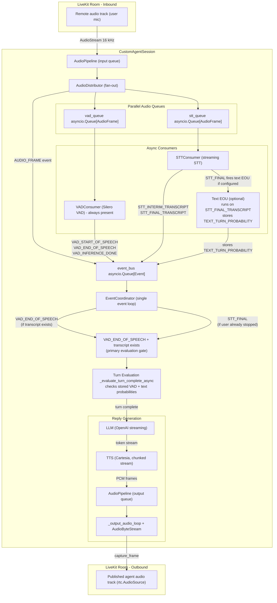

# SagePilot AI — Architecture Overview

This document describes the architecture of the custom voice orchestration system, focusing on how LiveKit is used as a transport layer while the full speech-to-response pipeline is owned and controlled directly in Python.

---

## Table of Contents

1. [Custom Orchestration Architecture](#1-custom-orchestration-architecture)
2. [Event Bus and Audio Queue System](#2-event-bus-and-audio-queue-system)
3. [Turn Detection](#3-turn-detection)
4. [LLM → TTS → Audio Output](#4-llm--tts--audio-output)
5. [Provider Abstraction Layer](#5-provider-abstraction-layer)
6. [Agent Selection and Tool Calling](#6-agent-selection-and-tool-calling)
7. [Backend Integration (FastAPI)](#7-backend-integration-fastapi)
8. [Frontend Integration (Next.js)](#8-frontend-integration-nextjs)
9. [Infrastructure](#9-infrastructure)

---

## 1. Custom Orchestration Architecture

The diagram below shows the full data path from the user's microphone to the agent's audio output.




---

## 2. Event Bus and Audio Queue System

### Audio Fan-Out Queues

`AudioDistributor` fans every incoming `AudioFrame` to exactly **two queues** — `_vad_queue` and `_stt_queue`. VAD is not optional; it is a required component of `CustomAgentSession` and always runs.


| Queue        | Fed by             | Consumer                   | Purpose                                                           |
| ------------ | ------------------ | -------------------------- | ----------------------------------------------------------------- |
| `_vad_queue` | `AudioDistributor` | `VADConsumer` (Silero VAD) | Detects start and end of speech; primary gate for turn evaluation |
| `_stt_queue` | `AudioDistributor` | `STTConsumer`              | Streaming speech-to-text; produces interim and final transcripts  |


After `STTConsumer` emits a `STT_FINAL_TRANSCRIPT` event, the `EventCoordinator` passes the accumulated transcript to the configured text-based EOU detector (`EOUTextTurnDetector` or `LiveKitEOUTurnDetector`), which stores a `TEXT_TURN_PROBABILITY`. This value is then read during turn evaluation — text EOU does not trigger evaluation itself, it only provides a probability score that the evaluator considers.

### The Event Bus

All consumers post results back to a single shared `_event_bus` (`asyncio.Queue[Event]`). An `Event` carries a typed `EventType` and a data payload. Key event types include:

- `VAD_START_OF_SPEECH` / `VAD_END_OF_SPEECH` / `VAD_INFERENCE_DONE`
- `STT_INTERIM_TRANSCRIPT` / `STT_FINAL_TRANSCRIPT`
- `TEXT_TURN_PROBABILITY` / `AUDIO_TURN_PROBABILITY`
- `INTERRUPTION_DETECTED`
- `AUDIO_FRAME`
- `SHUTDOWN`

`EventCoordinator` is the **single consumer** of the event bus. It runs one event loop and dispatches each event to the appropriate handler — updating user speech state, accumulating transcripts, and scheduling turn evaluation. All state mutations are serialised through one task, avoiding concurrency issues.

```
AudioDistributor
   │
   ├──► vad_queue ──► VADConsumer ───────────────► event_bus
   │
   └──► stt_queue ──► STTConsumer ───────────────► event_bus
                          │
                          └──► (on FINAL) ──► Text EOU (optiona) ──► event_bus

event_bus ──► EventCoordinator
```

---

## 3. Turn Detection

VAD is always running and is the primary gate for turn evaluation. Turn evaluation is triggered in one of two ways:

- `**VAD_END_OF_SPEECH**` fires and `_current_transcript` is non-empty — VAD detected silence after speech and STT has already produced text.
- `**STT_FINAL_TRANSCRIPT**` arrives and `_user_state != "speaking"` — the final transcript came in after VAD had already fired end-of-speech (race condition where STT lags slightly behind VAD).

If VAD fires end-of-speech but the transcript is still empty (STT hasn't returned yet), evaluation is deferred. The `STT_FINAL_TRANSCRIPT` handler will trigger it once the text arrives. This ensures evaluation only runs when both VAD and STT have contributed.

Once triggered, `_evaluate_turn_complete_async` checks the stored turn probabilities (which text EOU has been writing as STT finals arrive) and decides whether to respond.

### Detectors

Text-based EOU detectors live in `[livekit/src/custom_voice/turn_detection/](livekit/src/custom_voice/turn_detection/)`:


| Class                    | How it works                                                                                                                                     |
| ------------------------ | ------------------------------------------------------------------------------------------------------------------------------------------------ |
| `EOUTextTurnDetector`    | Heuristic rules: terminal punctuation, question marks, utterance length, context                                                                 |
| `LiveKitEOUTurnDetector` | Wraps LiveKit's own `EnglishModel.predict_end_of_turn`; builds a `ChatContext` from conversation history + current user line and calls the model |


A `VADBasedTurnDetector` (audio-level silence ramp) is also implemented but is tied to the incomplete audio turn detection path — see `[tradeoffs_and_next_steps.md](tradeoffs_and_next_steps.md)`.

A factory (`turn_detection/factory.py`) selects the detector by type string: `"eou"` or `"livekit_eou"`.

### Evaluation Flow

```
VAD_END_OF_SPEECH (+ transcript exists)
  OR STT_FINAL_TRANSCRIPT (+ user already stopped speaking)
    └─► _evaluate_turn_complete_async
          ├─ wait min_endpointing_delay
          ├─ read _text_turn_probability  (set by Text EOU on each STT final, if configured)
          ├─ no detector configured → respond immediately
          ├─ text detector → respond if text_prob >= threshold
          ├─ if below threshold: wait up to max_endpointing_delay, then respond anyway
          └─ _trigger_turn_complete → add user turn to ConversationContext → generate_reply
```

If new user speech begins before evaluation completes, the pending evaluation task is cancelled and rescheduled when the next `VAD_END_OF_SPEECH` fires.

---

## 4. LLM → TTS → Audio Output

Once a turn is confirmed, `generate_reply` runs the full response chain:

```
ConversationContext.to_llm_messages()
  └─► OpenAI LLM (streaming)
        └─► _collecting_token_stream()        ← accumulates tokens for history while yielding
              └─► CartesiaTTS.synthesize_stream_from_iterator()
                    ├─ buffers tokens by ChunkingStrategy (SENTENCE / WORD / IMMEDIATE)
                    └─► synthesize_stream(chunk) → PCM AudioFrame
                          └─► AudioPipeline output queue
                                └─► _output_audio_loop + AudioByteStream (rebatch PCM)
                                      └─► rtc.AudioSource.capture_frame → LiveKit published track
```

Key behaviours:

- **Streaming end-to-end**: LLM tokens flow directly into TTS without waiting for the full LLM response, minimising time-to-first-audio.
- **Chunking strategy**: TTS does not synthesise one token at a time. It buffers until a sentence boundary (or word/immediate depending on config) and sends that chunk to Cartesia, balancing latency against naturalness.
- **Conversation history**: `_collecting_token_stream` accumulates the full response while yielding, so `ConversationContext` is updated with the complete assistant turn after the reply finishes.
- **Interruption**: `InterruptionHandler` monitors VAD signals during agent output. If the user starts speaking while the agent is `"thinking"` or `"speaking"`, it cancels the LLM and TTS tasks, clears the audio pipeline buffers, and resets state — allowing the agent to respond to the interruption.

Agent state (`initializing` / `listening` / `thinking` / `speaking`) is written as a LiveKit participant attribute (`lk.agent.state`) so downstream clients can react to it.

---

## 5. Provider Abstraction Layer

Every AI provider is hidden behind a typed protocol interface defined in `[livekit/src/custom_voice/protocols.py](livekit/src/custom_voice/protocols.py)`. The rest of the pipeline only ever talks to these interfaces — it has no knowledge of which concrete provider is running underneath.

### Protocol interfaces


| Protocol      | Key methods                                                                 | Used by          |
| ------------- | --------------------------------------------------------------------------- | ---------------- |
| `STTProtocol` | `recognize_stream(audio_stream) -> AsyncIterable[TranscriptSegment]`        | `STTConsumer`    |
| `TTSProtocol` | `synthesize_stream(text)`, `synthesize_stream_from_iterator(text_iterator)` | `generate_reply` |
| `LLMProtocol` | `generate_stream(messages, tools) -> AsyncIterable[str]`                    | `generate_reply` |
| `VADProtocol` | `process_audio(frame) -> VADSignal`                                         | `VADConsumer`    |


Each protocol has a matching `Base`* abstract class (`BaseSTT`, `BaseTTS`, `BaseLLM`, `BaseVAD`) in the respective `stt/`, `tts/`, `llm/`, `vad/` subdirectories that implements shared behaviour (cancellation, configuration, lifecycle) so concrete providers only implement the actual API calls.

### STT providers


| Class           | File                | Provider                                                                      |
| --------------- | ------------------- | ----------------------------------------------------------------------------- |
| `DeepgramSTT`   | `stt/deepgram.py`   | Deepgram (WebSocket or HTTP batch; default model `nova-3`)                    |
| `AssemblyAISTT` | `stt/assemblyai.py` | AssemblyAI (WebSocket streaming; default model `universal-streaming-english`) |


Both implement the same `recognize_stream` interface. The caller receives `TranscriptSegment` objects with `text`, `is_final`, and `confidence` — provider-specific response formats are normalised inside each class.

### TTS providers


| Class           | File                | Provider                                                            |
| --------------- | ------------------- | ------------------------------------------------------------------- |
| `CartesiaTTS`   | `tts/cartesia.py`   | Cartesia (WebSocket or HTTP; default model `sonic-3`)               |
| `ElevenLabsTTS` | `tts/elevenlabs.py` | ElevenLabs (WebSocket streaming; default model `eleven_turbo_v2_5`) |


Both support `synthesize_stream_from_iterator`, which accepts an async iterator of LLM tokens directly. Internally each implementation handles chunking before sending to the provider API — the pipeline never needs to know about it.

### Factory pattern and provider selection

Each component has a factory function (`create_stt`, `create_tts`, `create_llm`, `create_vad`) that takes a `provider` string and returns the correct concrete instance. Configuration objects (`STTConfig`, `TTSConfig`, `LLMConfig`, `VADConfig`) carry provider-specific parameters and are passed through unchanged.

Provider selection happens at session start. The LiveKit job metadata carries a `config` block:

```json
{
  "stt_provider": "deepgram",
  "stt_config": { "language": "en", "transport": "websocket" },
  "tts_provider": "elevenlabs",
  "tts_config": { "voice": "some-voice-id" }
}
```

`custom_voice_example.py` reads these fields and calls the factories:

```
job metadata
  └─► session_config["stt_provider"] / session_config["stt_config"]
        └─► create_stt(provider="deepgram", **stt_config)  →  DeepgramSTT
  └─► session_config["tts_provider"] / session_config["tts_config"]
        └─► create_tts(provider="elevenlabs", voice=...) →  ElevenLabsTTS
```

Adding a new STT or TTS provider requires only: implementing the base class, registering the name in the factory. No changes to the session, consumers, or event bus are needed.

---

## 6. Agent Selection and Tool Calling

### Agent definitions

Agents are defined as Python classes in `[livekit/src/custom_voice/agent/agents.py](livekit/src/custom_voice/agent/agents.py)`, each extending `BaseAgent`:


| Agent                   | Name key            | System prompt focus       | Tools                                               |
| ----------------------- | ------------------- | ------------------------- | --------------------------------------------------- |
| `GeneralAssistantAgent` | `general_assistant` | General helpful assistant | `get_current_time`, `get_weather`                   |
| `CustomerSupportAgent`  | `customer_support`  | Order and returns support | `lookup_order`, `cancel_order`, `get_return_policy` |


The frontend passes a selected agent name to `POST /sessions/start`. The backend embeds it in the dispatch metadata. The worker reads `agent_name` from metadata, calls `create_agent(agent_name)`, and passes `agent.instructions` as the system prompt and `agent.tools` into the LLM.

### Tool calling flow

Tools are LangChain `@tool`-decorated async functions. `BaseAgent.get_tool_definitions()` converts them to OpenAI function-call JSON. `BaseAgent.make_tool_handler()` returns an async callable that dispatches by tool name to `tool.ainvoke(args)`.

When the LLM requests a tool call during `generate_stream`, the flow is:

```
LLM token stream → tool_calls detected in streamed response
  └─► _execute_tool_calls (asyncio.gather, runs all calls in parallel)
        └─► tool_handler(name, args)  ← BaseAgent.make_tool_handler()
              └─► call tool  ← actual function
                    └─► result string injected as ToolMessage into conversation
                          └─► LLM continues generating (up to _MAX_TOOL_ROUNDS = 5)
```

Tool results are also written back to `ConversationContext` so the full call/result history is preserved across turns.

---

## 7. Backend Integration (FastAPI)

The FastAPI backend (`backend/`) handles session lifecycle and acts as a broker between the frontend and LiveKit.

```
Frontend
  └─► POST /sessions/start
        └─► SessionService.start_session
              ├─ generate LiveKit room JWT  (backend/src/core/livekit.py)
              ├─ dispatch_agent("custom-voice-stack", metadata={session_id, config})
              └─► return { token, room_name, session_id }

LiveKit worker (on session end)
  └─► PATCH /sessions/{session_id}  ← posts full conversation transcript
```

The agent name `"custom-voice-stack"` matches the `@server.rtc_session(agent_name=...)` decorator in `[livekit/src/custom_voice_example.py](livekit/src/custom_voice_example.py)`, so LiveKit routes the dispatch to the correct worker.

Key backend files:

- `[backend/src/service/session_service.py](backend/src/service/session_service.py)` — session creation and agent dispatch
- `[backend/src/core/livekit.py](backend/src/core/livekit.py)` — JWT creation and agent dispatch wrappers
- `[backend/src/routes/session_routes.py](backend/src/routes/session_routes.py)` — HTTP routes

---

## 8. Frontend Integration (Next.js)

The frontend (`frontend/trial1/`) is a Next.js app that handles only the call UI and WebRTC connection. It does not interact with the voice pipeline directly.

```
Call page loads
  └─► POST /sessions/start (backend) → token, room_name, session_id
        └─► useVoiceConnection  (TokenSource.literal + NEXT_PUBLIC_LIVEKIT_URL)
              └─► @livekit/components-react connects to LiveKit room
                    └─► useVoiceAssistant reads lk.agent.state
                          └─► UI reflects: initializing / listening / thinking / speaking
```

Key frontend files:

- `[frontend/trial1/src/features/voice/hooks/useVoiceConnection.ts](frontend/trial1/src/features/voice/hooks/useVoiceConnection.ts)` — LiveKit room connection
- `[frontend/trial1/src/api/voice.api.ts](frontend/trial1/src/api/voice.api.ts)` — backend API calls
- `[frontend/trial1/app/call/[sessionId]/page.tsx](frontend/trial1/app/call/[sessionId]/page.tsx)` — call UI and agent state visualiser

---

## 9. Infrastructure

All services are defined in `[docker-compose.yml](docker-compose.yml)`:


| Service    | Description                                                                   |
| ---------- | ----------------------------------------------------------------------------- |
| `postgres` | Session persistence                                                           |
| `backend`  | FastAPI app, port 8000                                                        |
| `frontend` | Next.js app; build args include `NEXT_PUBLIC_LIVEKIT_URL` and backend API URL |
| `livekit`  | Python worker running `CustomAgentSession`; uses `./livekit/.env.prod`        |
| `dozzle`   | Container log viewer                                                          |


The LiveKit worker container connects to a LiveKit Cloud project (configured via `LIVEKIT_URL`, `LIVEKIT_API_KEY`, `LIVEKIT_API_SECRET` in the env file). The frontend browser connects to the same LiveKit project directly over WebSocket using the JWT issued by the backend.